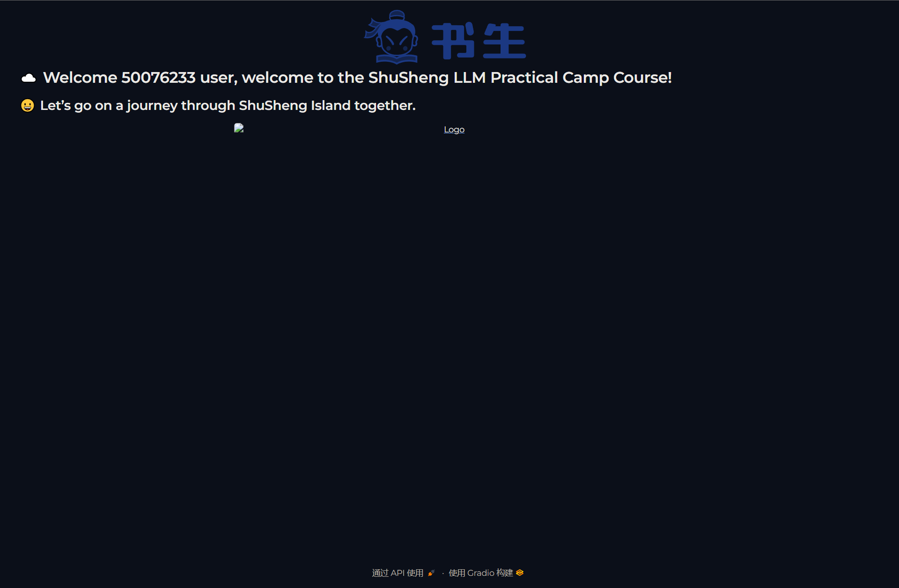

# 202501011_N01
开始闯关
第一关就遇到了vscode远程ssh开发机的时候要安装远端的vscode服务，总是失败，查遍网络都没找到方法，最后大力出奇迹，直接把开发机上的.vscode-server文件夹给删除了，重新在vscode上连接就好了。有可能是网络问题，第一次没在意中途给关了，以至于vscode-server安装不完整造成的。

python hello_world.py 成功，但不知道为什么没有图
